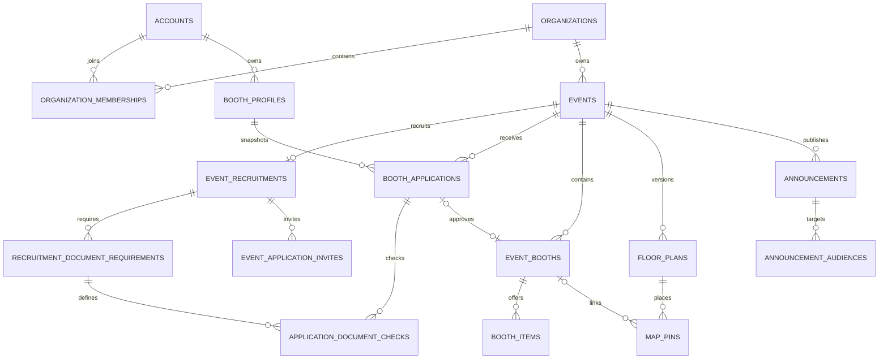

# 화면 기준 DB 설계 검토

2026-10-01. 주최자 화면 6장과 가입·로그인 요구를 반영한 **검토용 SQL 변경안**이다.
> 보관 자료: 5434번 ERD 검토 DB의 컨테이너·볼륨은 2026-10-03 제거했습니다. 아래는 이전 22테이블 설계안이며 현재 앱 DB 구조가 아닙니다.
> 현재 적용된 구조는 [앱 V2 migration](../../../src/main/resources/db/migration/V2__identity_and_organizations.sql)을 확인하세요.

아래의 원래 적용 대상은 [schema.sql](schema.sql)의 ERD 검토 DB였다. 앱 Flyway에는 자동 적용되지 않는다.
아래 정책은 구현을 위한 당시 추천 기본값이며 팀 확정을 의미하지 않는다. API 계약은 [API_DRAFT.md](../../API_DRAFT.md)에 있다.

## 화면과 데이터의 연결

| 화면 | 저장할 정보 | 조회할 때 계산할 정보 |
| --- | --- | --- |
| 가입·내 계정 | 계정, 로그인 수단, 닉네임, 연락처, 조직·소속 | 현재 행사에서 가능한 작업 |
| 네비게이션·대시보드 | 행사명, 주최 조직, 장소, 기간, 소개, 대표 이미지 | 진행 상태, 부스별 상태 개수, 최근 공지 |
| 부스 모집 | 소개, 마감일, 목표 부스 수, 카테고리, 참가비 안내, 요구 서류 | 모집 중/마감, 공개 행사 목록 노출 여부 |
| 부스 관리 | 신청 당시 부스·연락처, 심사 결과, 내부 메모, 반려 사유, 서류 확인 상태 | 신청 요약 개수, 승인 부스 번호 |
| 지도 제작 | 이미지 메타데이터, 지도 버전, 핀 종류·좌표·연결 부스 | 배치/미배치, 승인 부스 개수 |
| 실시간 운영 | 부스 운영 상태, 상품별 수동 재고 상태 | 부스 재고 요약, 배치 여부, 최근 변경 시각 |
| 공지 | 제목, 본문, 이미지, 대상 집합, 긴급 여부, 게시 상태 | 사용자에게 보이는 공지 목록 |

최적화의 기준은 현재 화면을 설명할 수 있는 데이터와 일관성이다. 실행계획·실제 부하를 측정한 성능 최적화는 아니다.

## 이번 변경

| 기존 | 변경 | 이유 |
| --- | --- | --- |
| `accounts.display_name` | `nickname` | 가입 폼의 닉네임. 신청자 실명이나 조직 이름과 구별 |
| 계정 전화번호 없음 | `phone_number` 추가 | 가입 필수값. 기호·공백을 제거한 번호를 저장 |
| nullable 계정 이메일 | 필수 이메일, 검증 시각은 nullable | 가입 입력과 실제 이메일 검증 여부를 구별 |
| 여러 테이블의 `status` | `account_status`, `organization_status`, `membership_status`, `invitation_status` | 상태가 무엇을 설명하는지 필드명으로 확인 |
| 신청 `status=SUBMITTED` | `review_status=PENDING` | 화면의 '검토 중'에 대응. 제출 시각은 `submitted_at` |
| `review_reason` | `review_note` / `rejection_reason` | 주최측 내부 메모와 신청자에게 알려줄 반려 사유 분리 |
| `event_booths.display_code` | 필수 `booth_code` | 승인/직접 등록 때 생성하는 행사 내 부스 번호. 지도 핀 이름과 독립 |
| 자유 입력 `category` | `category_code` | 모집 조건·검색·필터가 같은 카테고리를 사용 |
| `map_pins.kind` | `pin_type`, `OTHER_FACILITY` 추가 | 지도 화면의 기타 시설까지 표현 |
| `booth_memberships.role=OPERATOR` | 삭제 | 값이 하나뿐이다. 유효한 부스 소속 자체가 운영자 권한 |
| `booth_items.version` | `revision` | 수정 충돌 확인용 명칭을 다른 편집 데이터와 통일 |
| `media_assets.visibility` | 삭제 | 이미지 접근 권한은 연결된 행사·지도·공지와 사용자 권한으로 판정 |
| 행사 소개·대표 이미지 없음 | `events.description`, `poster_asset_id` | 대시보드·모집 화면에 사용 |
| 공지 이미지 연결 없음 | `announcements.image_asset_id` | 선택 이미지 한 장을 공지에 연결 |
| 모집·부스 초대·서류 확인 테이블 없음 | 아래 4개 테이블 추가 | 제공 화면의 실제 입력값을 보관 |

추가 테이블은 `event_recruitments`, `recruitment_document_requirements`,
`event_application_invites`, `application_document_checks`다. 총 22개 테이블이며 샘플 행은 없다.

`revision`은 행사·모집·부스 프로필·신청·서류 확인·부스·상품·지도·공지 수정 시 이전 값을 함께 보내 충돌을 확인하는 용도다.
`updated_at`과 `revision`은 DB의 기본값만으로 자동 갱신되지 않는다. 구현 시 서비스/JPA가 갱신해야 한다.

## 유지하는 관계

그림에서는 인증 정보·행사 위임·부스 소속·이미지·조직 초대·감사 기록을 생략했다. 전체 FK는 SQL/DBeaver에서 확인한다.

- 계정은 로그인 주체, 조직은 행사 소유 주체다. 가입 시 선택한 화면 유형을 계정의 고정 역할로 저장하지 않는다.
- 주최자 가입은 계정 생성과 새 조직·OWNER 소속 생성을 한 트랜잭션으로 묶는다. 조직 이름 입력만으로 기존 조직에 가입하지 않는다.
- `booth_profiles`는 재사용 소개, `booth_applications`는 신청 당시 기록, `event_booths`는 승인 후 운영 정보다. 합치면 원본 프로필 수정이 기존 신청·진행 중 행사에 영향을 준다.
- 신청의 `*_snapshot`은 이후 프로필이 바뀌어도 당시 신청 내용을 유지하기 위한 필드다. API 응답에서는 `boothName`, `applicantName` 같은 이름으로 변환한다.
- `organization_invitations`는 조직 담당자 초대, `event_application_invites`는 부스 신청 링크다. 후자는 권한을 부여하거나 자동 승인하지 않는다.
- 조직·행사·부스 소속과 감사 기록은 화면에 안 보여도 권한 검사·담당자 변경에 필요하므로 유지한다.

## 상태의 뜻

| 필드 | 값과 의미 |
| --- | --- |
| `account_status` | `ACTIVE` 사용 가능, `SUSPENDED` 정지, `DEACTIVATED` 비활성 |
| `organization_status` | `ACTIVE` 운영, `RECOVERY_REQUIRED` 운영권 복구 필요, `ARCHIVED` 보관 |
| `membership_status` | `ACTIVE` 유효 소속, `REVOKED` 권한 철회 |
| 신청 `review_status` | `PENDING` 검토 중, `APPROVED` 승인, `REJECTED` 반려 |
| 부스 `operation_status` | `PREPARING` 준비 중, `OPEN` 운영 중, `SOLD_OUT` 품절, `CLOSED` 마감 |
| 상품 `stock_status` | `UNLIMITED` 무제한, `AVAILABLE` 충분, `LOW` 부족, `SOLD_OUT` 품절 |
| 부스 `visibility_status` | `HIDDEN` 비공개, `PUBLIC` 공개, `ARCHIVED` 보관 |
| 행사·지도 `publication_status` | `DRAFT` 작성 중, `PUBLISHED` 게시, `ARCHIVED` 보관 |
| 모집 `publication_status` | `DRAFT` 비공개 작성, `PUBLISHED` 모집 공고 게시 |
| 공지 `publication_status` | `DRAFT` 임시 저장, `PUBLISHED` 게시, `DELETED` 삭제 처리 |
| 서류 `check_status` | `NOT_SUBMITTED` 미제출, `SUBMITTED` 외부 제출됨, `VERIFIED` 확인 완료, `NEEDS_CORRECTION` 보완 필요 |

카테고리 코드는 `FOOD` 음식, `BEVERAGE` 음료, `EXPERIENCE` 체험, `GAME` 게임, `GOODS` 굿즈, `OTHER` 기타다.
화면 라벨은 프론트가 이 코드에 대응시킨다. 화면마다 다른 문자열을 DB에 넣지 않는다.

다음 값은 DB 컬럼을 추가하지 않고 조회 결과에 포함한다.

- 행사 `scheduleStatus`: 일정 미정 `UNSCHEDULED`, 시작 전 `PREPARING`, 시작 이상·종료 미만 `ONGOING`, 종료 이후 `ENDED`. 시작/종료 중 하나라도 없으면 일정 미정이다. 게시 상태와 별개다.
- 모집 `recruitmentStatus`: `UNPUBLISHED`, `OPEN`, `CLOSED`. 모집 게시 상태와 `closes_at`으로 계산한다.
- 지도 `placementStatus`: 선택한 지도 버전에 연결된 핀이 있으면 `ASSIGNED`, 없으면 `UNASSIGNED`. 편집 화면은 초안, 운영 현황은 게시 지도가 기준이다.
- 운영 화면 `stockSummary`: 상품 없음 `NOT_TRACKED`; 전부 품절 `SOLD_OUT`; 전부 무제한 `UNLIMITED`; 부족 상품 또는 일부 품절이 있으면 `LOW`; 나머지는 `AVAILABLE`. 부스 자체의 운영 상태는 별도로 표시한다.
- `lastChangedAt`: 부스와 상품들의 `updated_at` 중 최신값. 재고뿐 아니라 소개·상품 편집도 포함하는 '최근 변경'이다.
- 신청·운영 요약 숫자: 서버가 행사 전체를 집계한다. 현재 페이지 7개의 행만 프론트에서 세면 전체 통계가 되지 않는다.

## 모집·서류·초대의 기본값

- `target_booth_count`는 모집 목표 수로 안내한다. 자동 승인 차단을 원하면 정원 정책과 동시 승인 제어를 따로 확정한다.
- 모집 카테고리와 서류 적용 카테고리는 고정 코드의 작은 집합이므로 PostgreSQL `text[]`로 둔다. DB가 코드·NULL 원소·다차원 배열을 검사하고 API가 중복을 제거한다. 자유 텍스트 CSV를 저장하지 않는다.
- 서류 `applicable_category_codes=[]`는 전체 카테고리에 적용한다. 식음료 서류라면 `['FOOD', 'BEVERAGE']`다.
- 첫 신청 접수 뒤 카테고리·참가비·서류 요구사항은 수정하지 않는 기본안이다. 과거 신청 조건이 바뀌는 일을 막는다. 소개·마감일·게시 여부·목표 수는 수정 가능하다.
- 보건증 등 서류 원본은 현재 수집하지 않고 외부 제출·확인 상태만 저장한다. 화면의 PDF '보기'는 이 범위에서 구현되지 않으므로 상태 표시 UI로 조정해야 한다.
- 부스 초대는 해시만 저장한다. 원문 코드/링크는 발급 직후 한 번 반환하며, 이후 조회는 만료·활성 정보만 반환한다. 대시보드는 '발급/재발급' UI가 필요하다. 항상 기존 코드를 다시 보여주는 정책을 원하면 저장 방식부터 재검토한다.
- 반려 뒤에는 새 신청을 허용한다. 같은 행사·프로필에 검토 중/승인 신청은 하나만 허용한다.
- 직접 등록 부스는 신청서 없이 `source=MANUAL`로 생성한다. 신청 목록·신청 통계에 가짜 승인 신청을 만들지 않는다. 관리 화면에 '신청'과 '승인·직접등록 부스'를 구별해 보여준다.

## 지도·이미지

이미지는 파일 저장소에 두고 DB에는 `bucket`, `object_key`, 크기·해상도·형식만 둔다.
대표 이미지와 공지 이미지에는 같은 행사의 이미지 ID만 연결할 수 있다. 파일 공개 여부를 별도 boolean으로 중복 저장하지 않는다.
이미지 URL을 발급하는 서버는 현재 게시 상태와 공지 대상을 검사한다. URL은 만료 가능한 조회 결과이며 DB에 영구 저장하지 않는다.

핀 좌표는 이미지 좌상단을 `(0, 0)`, 우하단을 `(1, 1)`로 하는 비율이다.
화면 확대율, 드래그 도구, 선택한 핀, 임시 이동 상태는 프론트 상태다. 핀 이름 `label`과 부스 번호 `booth_code`는 서로 바꾸지 않는다.
시설 핀에는 부스를 연결할 수 없고, 한 지도에 같은 부스는 한 번만 연결할 수 있다.

행사당 초안 지도와 게시 지도를 각각 최대 하나 유지한다. 이미지 버전 `version_no`와 편집 충돌용 `revision`은 의미가 달라 둘 다 둔다.
게시 지도를 편집할 때 초안을 만들고 저장한 뒤 별도로 게시한다. 다른 이미지로 교체하면 새 초안에 핀을 다시 배치한다.
같은 이미지의 게시 지도를 복제할 때만 핀 좌표를 복사한다. 예전 지도는 보관할 수 있다.

## DB 제약과 서비스 구현의 경계

| DB가 검사하는 것 | 서비스 트랜잭션에서 검사할 것 |
| --- | --- |
| 허용 상태·코드, 시간 순서, 음수 가격, 필수값 | 요청자의 계정·조직·행사·부스 권한 |
| 행사 내 부스 번호 중복, 한 신청에서 부스 하나 | 승인 때 부스·운영 소속·감사 기록 함께 생성 |
| 다른 행사의 지도·부스·이미지·서류 연결 방지 | 승인된 신청에 대해서만 운영 부스 생성 |
| 좌표 0~1, 시설 핀의 부스 연결 금지 | 비활성/보관 부스 배치 금지, 저장할 핀 집합 검증 |
| 지도별 부스 중복 배치 금지, 초안·게시 지도 각 하나 | 행사 행 잠금 후 기존 게시 지도 보관·새 지도 게시 |
| 반려 사유와 심사자·시각의 기본 일관성 | 허용 상태 전이, 자기 프로필 신청, 모집 기간·대상 카테고리 |
| 서류/신청/행사가 서로 일치 | 적용되는 필수 서류 모두 확인 후 승인 |
| 공지 게시 시 제목·본문·게시 시각 | 공지 대상 최소 하나, 독자별 접근, 공개 이미지 URL 발급 |
| 유효한 revision 숫자 | 기존 revision 비교, 충돌 409, 성공 시 증가·시각 갱신 |

조직 마지막 OWNER 보호, 감사 로그 append-only 정책도 서비스 구현이 필요하다.
CHECK/FK가 통과했다고 실제 권한·업무 기능이 구현된 것은 아니다.

## 적용과 확인

기존 Docker volume에는 이전 구조가 남아 있다. 이번 SQL은 신규 검토 DB를 만드는 전체 DDL이다.
이전 스키마 위에 재실행하면 `schema already exists`로 실패하며, 이 파일로 기존 테이블을 자동 변경하지 않는다.
기존 DB를 초기화하는 명령은 이번 작업에서 실행하지 않는다. 검토 후 기존 환경에 적용할 때는 별도 변경 SQL이나 새 검토 인스턴스를 사용한다.
팀 합의 뒤 실제 앱에는 새 Flyway migration을 작성한다. 이미 적용된 앱 migration을 고쳐서 맞추지 않는다.

`tests/constraints.sql`은 새 검토 DB에서 FK·CHECK·UNIQUE 위반과 정상 입력을 검사한 뒤 전체 트랜잭션을 롤백한다.
검증 행은 실행 중에만 존재하며 시연용 더미 데이터 파일이 아니다. 서버 권한·경합 API 테스트는 API 구현 후 추가한다.

2026-10-01 검증 결과: 영구 volume과 외부 포트가 없는 임시 PostgreSQL 17에서 22개 테이블 생성에 성공했다.
33개 잘못된 입력의 제약 위반과 정상 초안·배치·재신청·스냅샷 유지 사례가 통과했고, 롤백 후 22개 테이블 모두 0행임을 확인했다.
임시 컨테이너는 종료했다. 기존 ERD/앱 DB에는 이번 DDL을 적용하지 않았다.

설계 근거: [PostgreSQL 제약](https://www.postgresql.org/docs/17/ddl-constraints.html),
[트랜잭션 행 잠금](https://www.postgresql.org/docs/17/explicit-locking.html). 확인일 2026-10-01.
